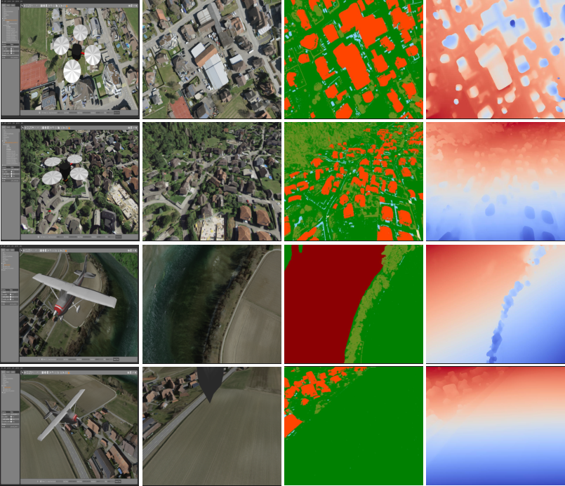

# Photo-Realistic and Labeled Synthetic UAV Flight Data Generation Using ROS and Gazebo

This repository contains the necessary files to simulate UAV's aircraft models in Gazebo with ROS integration. The simulation generates synthetic data that includes various sensors data such as IMU, GPS, camera images, semantic segmentation and depth maps.

This repository also contains a script of the whole process to create the synthetic data dataset.



If you find this work useful for your research, please cite our paper:

```bibtex
@inproceedings{silva2024,
    title        = {Photo-Realistic and Labeled Synthetic UAV Flight Data Generation Using ROS and Gazebo},
    author       = {Silva, Lucas and Ferreira, Juliana Quintiliano  and Rezeck, Paulo and Silva, Michel and Gomes, Thiago L.},
    year         = 2024,
    booktitle    = {Proceedings of the 21st Latin American Robotics Symposium (LARS 2024)}, 
}
```

## Prerequisites

- Docker installed on your system
- Docker Compose installed on your system
- Virtualenv installed on your system

## Getting Started

### 1. Clone the Repository

First, clone this repository to your local machine:

```bash
git clone https://github.com/MaVILab-UFV/lucas-ros-drone-simulation-.git
cd lucas-ros-drone-simulation-
```
### 2. Build the Docker Container

Ensure that you have Docker and Docker Compose installed. Then, use the provided docker-compose.yml to build and run the Docker container.

```
cd ros-gazebo-simulation
docker compose build
```

The Docker compose build should take a while. After it is finished:
```
cd ..
```
## Launching Script

The script will download 5 georreferenced images and pointsClouds to create 5 simulation maps with dimensions of 10000x10000.
Also, it is going to create the path planning waypoints, launch the simulation and create the sinthetic data as view images, drone information files and semantic segmentation.

```bash
./run_all.sh
```

### Setting Changes

If you desire to create different maps, you must insert the URLs of both .tif and .las files in the script "./run_all.sh".

``````
tif_images=(URLs of the .tif files)

las_files=(URLS of the .las files)
``````

Also, You can change the dimensions of the world.

```
x_min=0
y_min=0
world_size=10000
```

### Colorize Semantic Segmentation Image

We also provide a script that colors the semantic images from a single color channel to an RGB channel.

```bash
python3 colorize-semantic.py input_folder output_folder
```

## Contact

### Authors

| [Lucas Silva](https://github.com/Lucas-silva23)| [Juliana Quintiliano Ferreira](https://github.com/JulianaQuintiliano) | [Michel Silva](https://michelmelosilva.github.io/) | [Thiago L. Gomes](https://github.com/thiagoluange) | [Paulo Rezeck](https://rezeck.github.io/) |
| :--------------------------------------------: | :-------------------------------------------------------------------: | :------------------------------------------------: |:-------------------------------------------------: |:-------------------------------------------------: |
|                  BSc. Student¹                  |                           MSc. Student¹                               |                Assistant Professor¹                |                Assistant Professor¹                |   Researcher¹                            |
|            <lucas.silva23@ufv.br>              |                    <juliana.q.ferreira@ufv.br>                        |              <michel.m.silva@ufv.br>               |               <thiago.luange@ufv.br>               |  <rezeck@dcc.ufmg.br>    |

¹Universidade Federal de Viçosa \
Departamento de Informática \
Viçosa, Minas Gerais, Brazil

### Laboratory

| [](https://mavilab-ufv.github.io/) | [](src/logotipo-UFV.png)|
| --------------------------------------------------------------------------------------------------------------------------------------------------------------------------- |---------------------------------------------------------------- |

**MaVILab**: Machine Vision and Intelligence Laboratory \
 <https://mavilab-ufv.github.io>

## Acknowledgements

We would like to thank CAPES, CNPq, FAPEMIG, and Finep for supporting this project.


